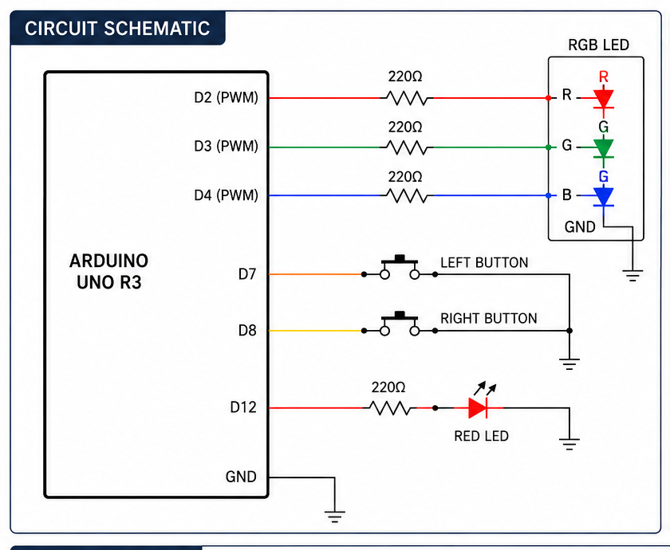
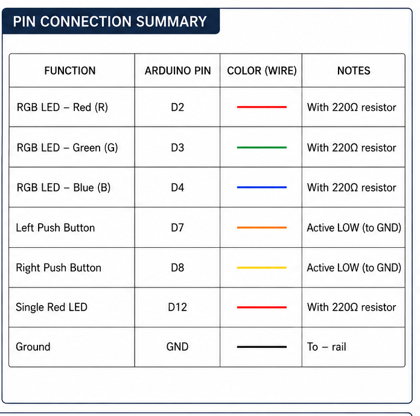
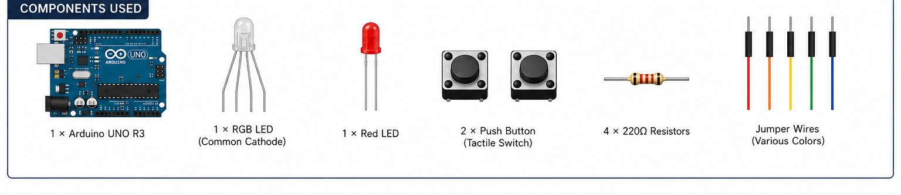

# Arduino RGB LED Button Controller

## Overview

This project demonstrates how to control an RGB LED and a separate red LED using two push buttons connected to an Arduino Uno.

The project uses digital inputs, digital outputs, and conditional logic to determine which LEDs should turn on based on the button presses.

This project was designed and programmed from scratch as part of my journey learning Arduino programming and C++.

## Components Used

- Arduino Uno R3
- 1 × RGB LED (Common Cathode)
- 1 × Red LED
- 4 × 220 Ω Resistors
- 2 × Push Buttons
- Breadboard
- Jumper Wires

## Pin Connections

| Arduino Pin | Component |
|--------------|-----------|
| D2 | RGB LED - Red |
| D3 | RGB LED - Green |
| D4 | RGB LED - Blue |
| D7 | Left Push Button |
| D8 | Right Push Button |
| D12 | Red LED |
| GND | RGB LED, Red LED, Both Push Buttons |

## Features

- Controls an RGB LED and a separate red LED using two push buttons.
- Uses `INPUT_PULLUP` for reliable button input detection.
- Turns on the RGB green LED when the left button is pressed.
- Turns on both red LEDs when the right button is pressed.
- Activates **COP Mode** (blue RGB LED + red LED) when both buttons are pressed simultaneously.
- Turns all LEDs off when no buttons are pressed.

## How It Works

The Arduino continuously checks the state of both push buttons using the `INPUT_PULLUP` configuration.

The program follows this logic:

- **Both buttons pressed:** Activates **COP Mode**, turning on the blue RGB LED and the separate red LED.
- **Right button pressed:** Turns on the RGB red LED and the separate red LED.
- **Left button pressed:** Turns on the RGB green LED.
- **No buttons pressed:** Turns all LEDs off.

## Circuit Schematic

## Pin Connection Summary

## Components Used

## What I Learned

While building this project, I learned how to:

- Configure Arduino pins as inputs and outputs.
- Use `INPUT_PULLUP` for reliable button detection.
- Read button states using `digitalRead()`.
- Control LEDs using `digitalWrite()`.
- Build decision making using `if`, `else if`, and `else`.
- Organize an Arduino project with clear documentation using GitHub.

## Future Improvements

- Add RGB color cycling.
- Implement button debouncing.
- Add PWM brightness control.
- Store the last selected color using EEPROM.
- Add a passive buzzer for audio feedback.
